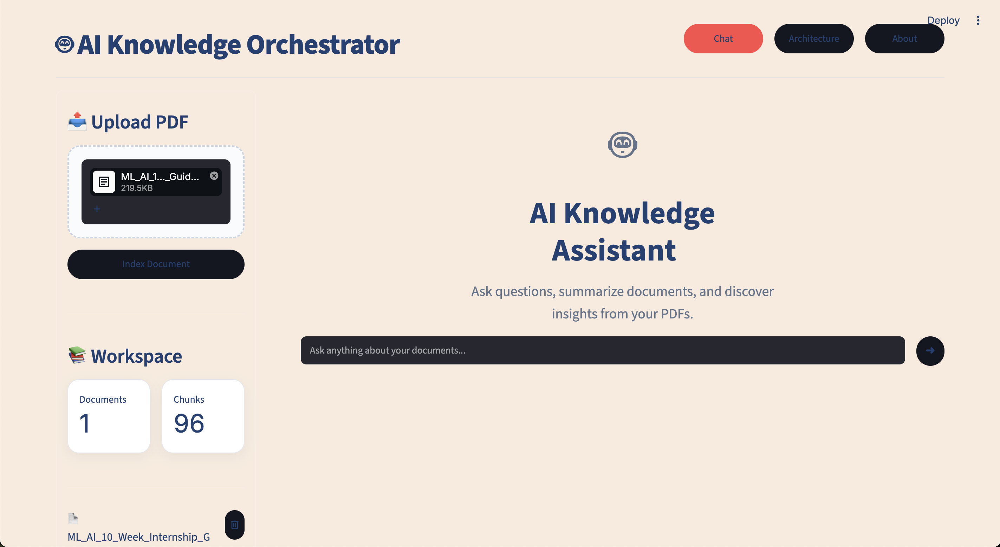
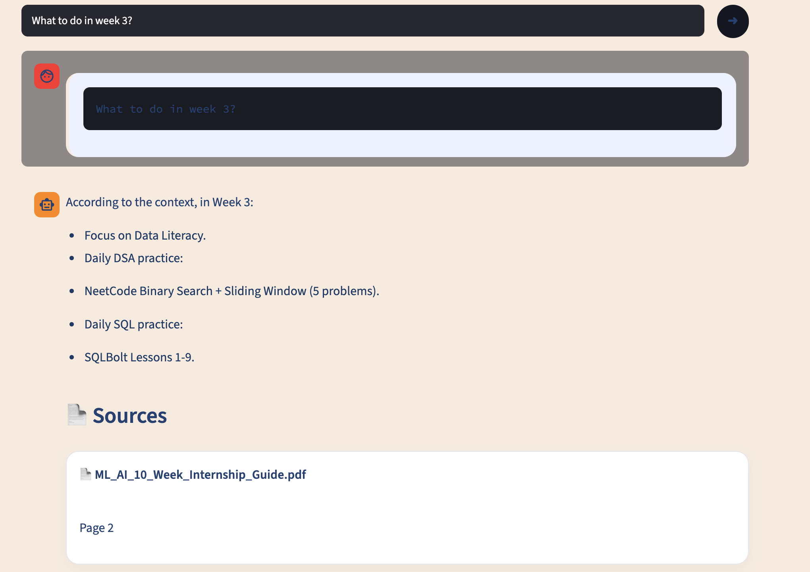
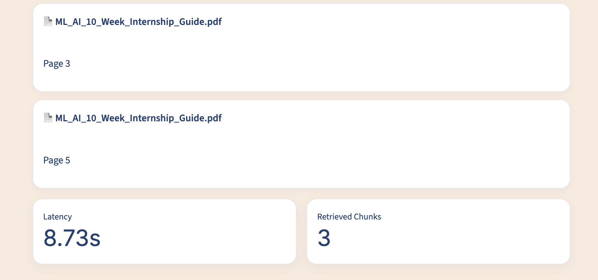
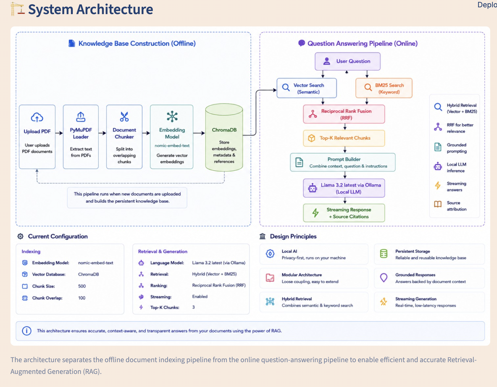
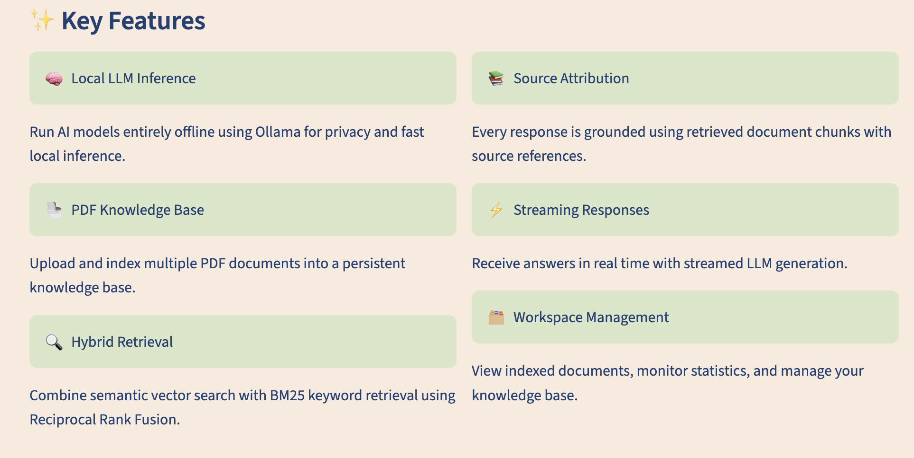
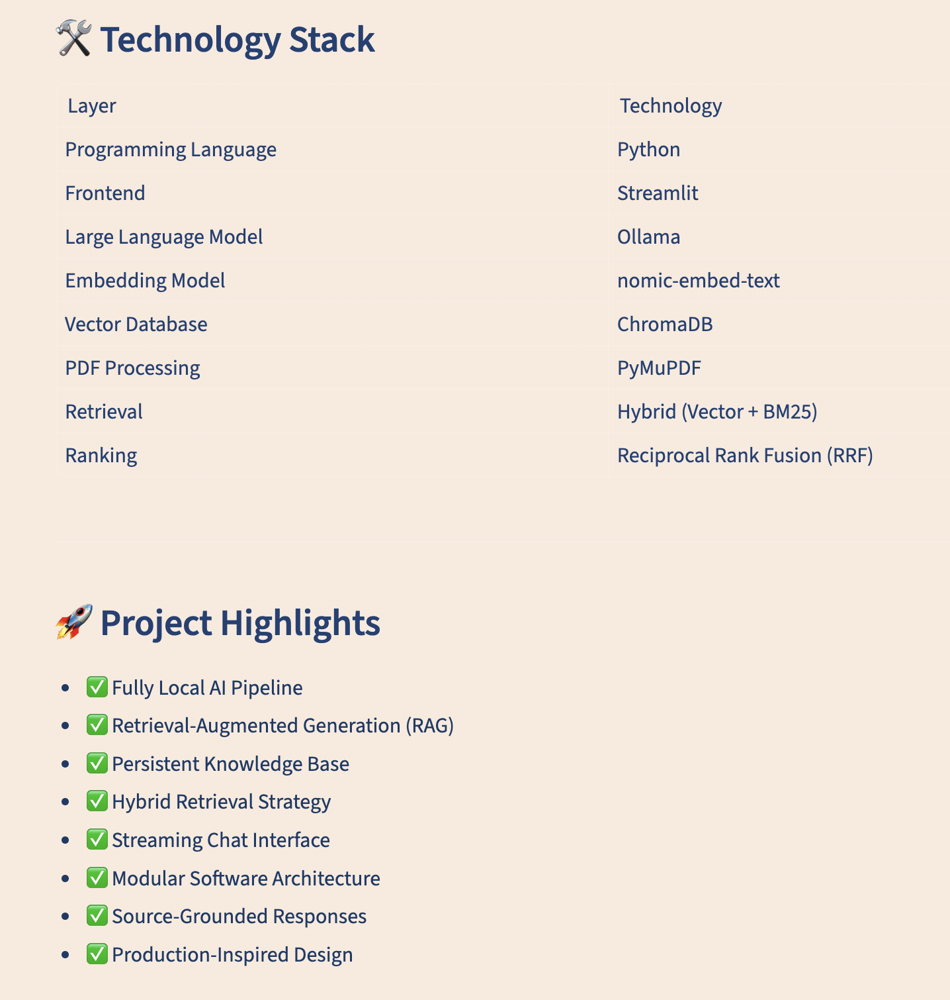

# 🤖 AI Knowledge Assistant

<p align="center">
  <strong>An intelligent Retrieval-Augmented Generation (RAG) system that enables conversational interaction with PDF documents using Hybrid Retrieval, Local LLMs, and a modern Streamlit interface.</strong>
</p>

<p align="center">

<!-- Badges (We'll add these later) -->

Python • Streamlit • Ollama • ChromaDB • Hybrid Retrieval • BM25 • RAG

</p>

---

## 📸 Application Preview

<p align="center">



</p>

---

# 📖 Overview

AI Knowledge Orchestrator is a fully local Retrieval-Augmented Generation (RAG) application that transforms PDF documents into an interactive knowledge base.

Instead of relying solely on semantic vector search, the application combines dense retrieval from ChromaDB with lexical retrieval using BM25. The retrieved results are fused using Reciprocal Rank Fusion (RRF), providing more accurate and context-aware responses.

The entire inference pipeline runs locally through Ollama, enabling private document interaction without requiring cloud-based LLM APIs.

---

# ✨ Features

### 📄 Document Processing

- Upload PDF documents through a clean workspace interface
- Automatic text extraction using PyMuPDF
- Intelligent document chunking
- Persistent knowledge base

---

### 🔍 Hybrid Retrieval

- Semantic Vector Search
- BM25 Keyword Search
- Reciprocal Rank Fusion (RRF)
- Context-aware document retrieval

---

### 🤖 Local AI

- Ollama-powered inference
- Llama 3.2 integration
- Fully offline execution
- Streaming response generation

---

### 📚 Explainable Responses

- Source attribution
- Retrieved page references
- Latency statistics
- Retrieved chunk count

---

### 🎨 Modern User Interface

- Responsive Streamlit interface
- Workspace management
- AI pipeline visualization
- Interactive architecture explorer

---

# 🎥 Demo

> *https://diabetes-detection-explainable-ai.streamlit.app/*

---

# 🏗️ System Architecture


The application follows a modular Retrieval-Augmented Generation pipeline consisting of document ingestion, semantic indexing, hybrid retrieval, prompt construction, and local language model inference.

---

# ⚙️ Pipeline Workflow

```text
                    PDF Documents
                           │
                           ▼
                  Document Loader
                           │
                           ▼
                 Text Chunking Pipeline
                           │
            ┌──────────────┴──────────────┐
            ▼                             ▼
      Embedding Model                BM25 Index
            │                             │
            ▼                             ▼
        ChromaDB                  Lexical Retrieval
            └──────────────┬──────────────┘
                           ▼
             Reciprocal Rank Fusion
                           ▼
                 Context Construction
                           ▼
                  Ollama (Llama 3.2)
                           ▼
                Streaming Response
```

---

# 🛠️ Technology Stack

| Category | Technology |
|-----------|------------|
| Programming Language | Python |
| Frontend | Streamlit |
| Local LLM | Ollama |
| Language Model | Llama 3.2 |
| Embedding Model | Nomic Embed Text |
| Vector Database | ChromaDB |
| PDF Processing | PyMuPDF |
| Retrieval | Hybrid (Vector + BM25) |
| Ranking | Reciprocal Rank Fusion (RRF) |

---

# 📂 Project Structure

```text
AI-Knowledge-Orchestrator/
│
├── app/
│   ├── core/
│   ├── embeddings/
│   ├── indexing/
│   ├── ingestion/
│   ├── llm/
│   ├── retrieval/
│   └── services/
│   └── utils/
│   └── vectorstore/
│
├── components/
│   └── assets/
│   ├── chat/
│   ├── layout/
│   ├── pages/
│   ├── sidebar/
│
├── data/
├── app.py
├── requirements.txt
└── README.md
```

---

# 🚀 Installation

```bash
git clone https://github.com/<YOUR_USERNAME>/AI-Knowledge-Orchestrator.git

cd AI-Knowledge-Orchestrator

python -m venv .venv

source .venv/bin/activate

pip install -r requirements.txt

ollama pull llama3.2

streamlit run app.py
```

---

# 💬 Usage

1. Upload one or more PDF documents.
2. Index the uploaded knowledge base.
3. Ask questions in natural language.
4. The application retrieves relevant document chunks using Hybrid Retrieval.
5. Retrieved context is sent to the local LLM.
6. Receive grounded responses with source attribution.

---

# 🖼️ Screenshots

## Home


---

## Chat Interface



---

## Source Attribution



---

## Architecture



---

## Technology Overview




---

# 🚀 Future Improvements

- OCR support for scanned PDFs
- Multi-document collections
- Citation highlighting
- Conversation memory
- Cloud deployment
- Authentication
- Multi-user workspaces
- Additional LLM providers

---

# 📄 License

This project is licensed under the MIT License.

---

# 👨‍💻 Author

**Rishi Shah**

If you found this project helpful, feel free to ⭐ the repository.
